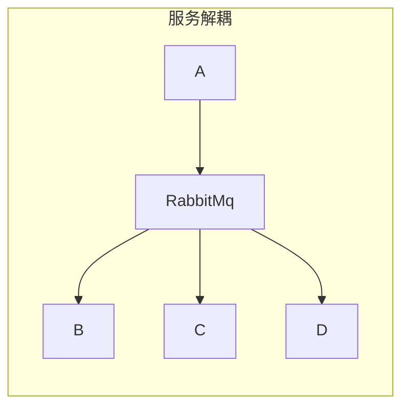
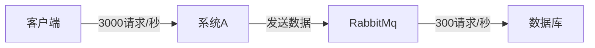
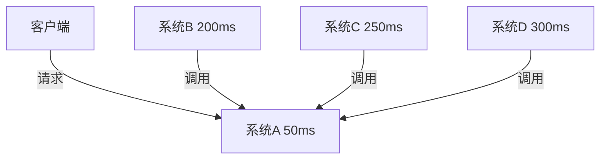
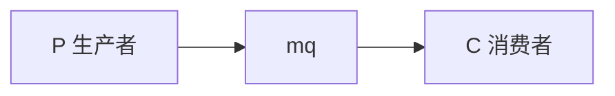
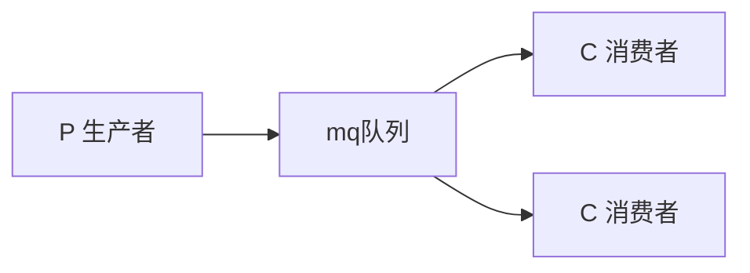
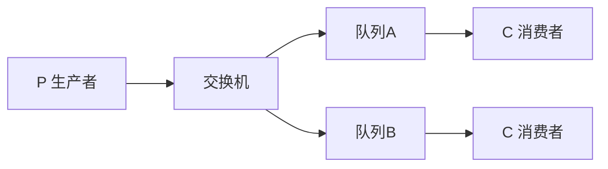
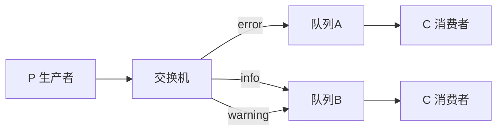
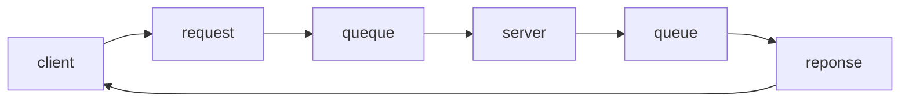

[TOC]


 ###   什么是消息队列

**`消息`**指的是两个应用间传递的数据。数据的类型有很多种形式，可能只包含文本字符串，也可能包含嵌入对象。


**`“消息队列(Message Queue)”是在消息的传输过程中保存消息的容器`**。在消息队列中，通常有生产者和消费者两个角色。生产者只负责发送数据到消息队列，谁从消息队列中取出数据处理，他不管。消费者只负责从消息队列中取出数据处理，他不管这是谁发送的数据。

###  RabbitMq使用场景

#### `服务解耦`

​				A服务只需要向消息服务器发送消息,而不用考虑谁需要这些数据;下游服务如果需要数据,自行从消息服务器订阅消息,不再需要数据时则取消订阅即可



#### `流量削峰`

​				高峰情况下,瞬间出现的大量请求数据,先发送到消息队列服务器,排队等待被处理,而我们的应用,可以慢慢的从消息队列接收请求数据进行处理,这样把数据处理时间拉长,以减轻瞬时压力




#### `异步调用`

​				使用MQ，系统A发送数据到MQ，然后就可以返回响应给客户端，不需要再等待系统B、C、D的响应，可以大大地提高性能




 ### RabbitMq基本概念

- **`Broker：`**消息队列服务进程。此进程包括两个部分：Exchange和Queue。

  

- **`Exchange：`**消息队列交换机。接受生产者发送的消息，并根据Binding规则将消息路由给服务器中的队列。ExchangeType决定了Exchange路由消息的行为

  

- **`Binding：`**绑定，用于消息队列和交换器之间的关联。一个绑定就是基于路由键将交换器和消息队列

  连接起来的路由规则，所以可以将交换器理解成一个由绑定构成的路由表。

  

- **`Message Queue：`**消息队列。我们发送给RabbitMQ的消息最后都会到达各种queue，并且存储在其中(如果路由找不到相应的queue则数据会丢失)，等待消费者来取。

  

- **`Routing Key：`**路由关键字,exchange根据这个关键字进行消息投递。生产者在将消息发送给Exchange的时候，一般会指定一个routing key，来指定这个消息的路由规则。这个routing key需要与Exchange Type及binding key联合使用才能生，我们的生产者只需要通过指定routing key来决定消息流向哪里

  

- **`vhost：`**虚拟主机,一个broker里可以有多个vhost，用作不同用户的权限分离。每个 vhost 本质上就是一个 mini 版的 RabbitMQ 服务器，拥有自己的队列、交换器、绑定和权限机制。vhost 是 AMQP 概念的基础，必须在连接时指定，RabbitMQ 默认的 vhost 是 / 。

### RabbitMq六种工作模式

#### `简单模式`



- P：生产者，也就是要发送消息的程序

- C：消费者：消息的接受者，会一直等待消息到来。

- queue：消息队列，图中mq部分。可以缓存消息；生产者向其中投递消息，消费者从其中取出消息。 

 ==代码实现==

**连接工具类**

```java
public class ConnectionUtil {
    /**
     * 建立与RabbitMQ的连接
     * @return
     * @throws Exception
     */
    public static Connection getConnection() throws Exception {
        //定义连接工厂
        ConnectionFactory factory = new ConnectionFactory();
        //设置服务地址
        factory.setHost("127.0.0.1");
        //端口
        factory.setPort(5672);
       /*		设置账号信息，用户名、密码、vhost
      	*		设置虚拟机，一个mq服务可以设置多个虚拟机，每个虚拟机就相当于一个独立的mq
      	*		Host默认为”/“
      	*/
        factory.setVirtualHost("/kavito");
        factory.setUsername("kavito");
        factory.setPassword("123456");
        // 通过工厂获取连接
        Connection connection = factory.newConnection();
        return connection;
    }
}
```

**生产者**

```java
public class Send {

    private final static String QUEUE_NAME = "simple_queue";

    public static void main(String[] argv) throws Exception {
        // 1、获取到连接
        Connection connection = ConnectionUtil.getConnection();
        // 2、从连接中创建通道，使用通道才能完成消息相关的操作
        Channel channel = connection.createChannel();
       
        /**
         *  3、声明（创建）队列
         * @param queue 队列名称
         * @param durable 是否持久化，如果持久化，mq重启后队列还在
         * @param exclusive 是否独占连接，队列只允许在该连接中访问，
         * 如果connection连接关闭队列则自动删除,如果将此参数设置true可用于临时队列的创建
         * @param autoDelete 自动删除，队列不再使用时是否自动删除此队列，
         * 如果将此参数和exclusive参数设置为true就可以实现临时队列（队列不用了就自动删除）
         * @param arguments 参数，可以设置一个队列的扩展参数，比如：可设置存活时间
         * @throws IOException
         */
        channel.queueDeclare(QUEUE_NAME, false, false, false, null);
        // 4、消息内容
        String message = "Hello World!";      
       
        /**
         * 向指定的队列中发送消息
         * Publish a message.
         * @param exchange 交换机，如果不指定将使用mq的默认交换机（设置为""）
         * @param routingKey 路由key，交换机根据路由key来将消息转发到指定的队列如果使用默认交换机						*				 routingKey设置为队列的名称
         * @param props 消息的属性
         * @param body 消息内容
         * @throws IOException
         */
        channel.basicPublish("", QUEUE_NAME, null, message.getBytes());
        System.out.println(" [x] Sent '" + message + "'");

        //关闭通道和连接(资源关闭最好用try-catch-finally语句处理)
        channel.close();
        connection.close();
    }
}
```

**消费者**

```java
public class Recv {
    private final static String QUEUE_NAME = "simple_queue";
 
    public static void main(String[] argv) throws Exception {
        // 获取到连接
        Connection connection = ConnectionUtil.getConnection();
        //创建会话通道,生产者和mq服务所有通信都在channel通道中完成
        Channel channel = connection.createChannel();
        // 声明队列
      
        channel.queueDeclare(QUEUE_NAME, false, false, false, null);
        //实现消费方法
        DefaultConsumer consumer = new DefaultConsumer(channel){
            // 获取消息，并且处理，这个方法类似事件监听，如果有消息的时候，会被自动调用
            /**
             * 当接收到消息后此方法将被调用
             * @param consumerTag  消费者标签，用来标识消费者的，在监听队列时设置channel.basicConsume
             * @param envelope 信封，通过envelope
             * @param properties 消息属性
             * @param body 消息内容
             * @throws IOException
             */
            @Override
            public void handleDelivery(String consumerTag, Envelope envelope, AMQP.BasicProperties properties, byte[] body) throws IOException {
                //交换机
                String exchange = envelope.getExchange();
                //消息id，mq在channel中用来标识消息的id，可用于确认消息已接收
                long deliveryTag = envelope.getDeliveryTag();
                // body 即消息体
                String msg = new String(body,"utf-8");
                System.out.println(" [x] received : " + msg + "!");
            }
        };
        
        
      
       //监听队列，第二个参数：是否自动进行消息确认。
      /**
       * @param queue 队列名称
       * @param autoAck 自动回复，当消费者接收到消息后要告诉mq消息已接收，如果将此参数设置为tru表示			会自动回复mq，如果设置为false要通过编程实现回复
       * @param callback 消费方法，当消费者接收到消息要执行的方法
       * @throws IOException 
       */
        channel.basicConsume(QUEUE_NAME, true, consumer);
    }
}
```

##### `消息确认机制（ACK）`

自己查。。。。

#### `工作模式`



多个消费端共同消费一个队列中的消息，但是一个消息只能被一个消费者获取。

**生产者**

```java
public class Send {
    private final static String QUEUE_NAME = "test_work_queue";
 
    public static void main(String[] argv) throws Exception {
        // 获取到连接
        Connection connection = ConnectionUtil.getConnection();
        // 获取通道
        Channel channel = connection.createChannel();
        // 声明队列
        channel.queueDeclare(QUEUE_NAME, false, false, false, null);
        // 循环发布任务
        for (int i = 0; i < 50; i++) {
            // 消息内容
            String message = "task .. " + i;
            channel.basicPublish("", QUEUE_NAME, null, message.getBytes());
            System.out.println(" [x] Sent '" + message + "'");
            Thread.sleep(i * 2);
        }
        channel.close();
        connection.close();
    }
}
```

**消费者1**

```java
public class Recv {
    private final static String QUEUE_NAME = "test_work_queue";
 
    public static void main(String[] argv) throws Exception {
        // 获取到连接
        Connection connection = ConnectionUtil.getConnection();
        //创建会话通道,生产者和mq服务所有通信都在channel通道中完成
        Channel channel = connection.createChannel();
        // 声明队列
        channel.queueDeclare(QUEUE_NAME, false, false, false, null);
        //实现消费方法
        DefaultConsumer consumer = new DefaultConsumer(channel){
            // 获取消息，并且处理，这个方法类似事件监听，如果有消息的时候，会被自动调用
            @Override
            public void handleDelivery(String consumerTag, Envelope envelope, AMQP.BasicProperties properties, byte[] body) throws IOException {
                // body 即消息体
                String msg = new String(body,"utf-8");
                System.out.println(" [消费者1] received : " + msg + "!");
                //模拟任务耗时1s
                try { TimeUnit.SECONDS.sleep(1); } catch (Exception e) { e.printStackTrace(); }
            }
        };
        // 监听队列，第二个参数：是否自动进行消息确认。
        channel.basicConsume(QUEUE_NAME, true, consumer);
    }
}
```

消费者2与消费者1代码基本一致，只是消费者2没有设置消费耗时时间。

通过结果可以发现两个消费者都消费了25条消息，这就实现了任务的分发。

#####  `能者多劳`

刚才的实现是不合理的：

1. 消费者1比消费者2消耗更长时间
2. 两者最终消费额消息数量是一致的
3. 在这个任务中，消费者2大多时间处于空闲，消费者1一直处于忙碌状态

我们应充分利用消费2的时间，提高执行任务的效率，也就是能者多劳

通过 BasicQos 方法设置prefetchCount = 1。这样RabbitMQ就会使得每个Consumer在同一个时间点最多处理1个Message。换句话说，在接收到该Consumer的ack前，他它不会将新的Message分发给它。相反，它会将其分派给不是仍然忙碌的下一个Consumer。

==值得注意的是：prefetchCount在手动ack的情况下才生效，自动ack不生效。==

**消费者类**

```java
    // 声明队列
		channel.queueDeclare(QUEUE_NAME, false, false, false, null);
    // 设置每个消费者一次只能处理一条消息，在手动ack下生效
 		channel.basicQos(1);
```

更改basicConsume第二个参数

```java
// 监听队列，第二个参数：是否自动进行消息确认。
 channel.basicConsume(QUEUE_NAME, false, consumer);
```

#### `发布订阅模式`



我们将做一些完全不同的事情——我们将向多个消费者传递同一条消息。这种模式称为“发布/订阅”。

##### ```Exchange交换机```

​		RabbitMQ消息传递模型的核心思想是，生产者永远不会将任何消息直接发送到队列。实际上，通常生产者甚至不知道消息是否会被传递到任何队列。

​		相反，生产者只能向交换机(Exchange)发送消息。交换机是一个非常简单的东西。一边接收来自生产者的消息，另一边将消息推送到队列。交换器必须确切地知道如何处理它接收到的消息。它应该被添加到一个特定的队列中吗?它应该添加到多个队列中吗?或者它应该被丢弃。这些规则由exchange的类型定义。

**有几种可用的交换类型:direct、topic、header和fanout**

```fanout交换机```非常简单。它只是将接收到的所有消息广播给它所知道的所有队列。这正是我们的日志系统所需要的

**生产者**

```java
public class Send {
    private final static String EXCHANGE_NAME = "test_fanout_exchange"; 
    public static void main(String[] argv) throws Exception {
        // 获取到连接
        Connection connection = ConnectionUtil.getConnection();
        // 获取通道
        Channel channel = connection.createChannel();
        // 声明exchange，指定类型为fanout
        channel.exchangeDeclare(EXCHANGE_NAME, "fanout");
        
        // 消息内容
        String message = "注册成功！！";
        // 发布消息到Exchange
        channel.basicPublish(EXCHANGE_NAME, "", null, message.getBytes());
        System.out.println(" [生产者] Sent '" + message + "'");
 
        channel.close();
        connection.close();
    }
}
```

**消费者**

```java
public class Recv {
    private final static String QUEUE_NAME = "fanout_exchange_queue_sms";//短信队列 
    private final static String EXCHANGE_NAME = "test_fanout_exchange"; 
    public static void main(String[] argv) throws Exception {
        // 获取到连接
        Connection connection = ConnectionUtil.getConnection();
        // 获取通道
        Channel channel = connection.createChannel();
        // 声明队列
        channel.queueDeclare(QUEUE_NAME, false, false, false, null);
 
        // 绑定队列到交换机
        channel.queueBind(QUEUE_NAME, EXCHANGE_NAME, "");
 
        // 定义队列的消费者
        DefaultConsumer consumer = new DefaultConsumer(channel) {
            // 获取消息，并且处理，这个方法类似事件监听，如果有消息的时候，会被自动调用
            @Override
            public void handleDelivery(String consumerTag, Envelope envelope, AMQP.BasicProperties properties,
                                       byte[] body) throws IOException {
                // body 即消息体
                String msg = new String(body);
                System.out.println(" [短信服务] received : " + msg + "!");
            }
        };
        // 监听队列，自动返回完成
        channel.basicConsume(QUEUE_NAME, true, consumer);
    }
}
```

##### ```思考：```

**==发布订阅模式与工作者模式有什么区别。==**

**区别：**

1. work queues不用定义交换机，而publish/subscribe需要定义交换机。
2. publish/subscribe的生产方是面向交换机发送消息，work queues的生产方是面向队列发送消息(底层使用默认交换机)。
3. publish/subscribe需要设置队列和交换机的绑定，work queues不需要设置，实际上work queues会将队列绑定到默认的交换机 。

**相同点：**


​			所以两者实现的发布/订阅的效果是一样的，多个消费端监听同一个队列不会重复消费消息。

==**实际工作用 发布订阅模式还是工作者模式。**==

​			建议使用 发布订阅模式，发布订阅模式比工作队列模式更强大（也可以做到同一队列竞争），并且发布订阅模式可以指定自己专用的交换机。

#### `路由模式`



P：生产者，向Exchange发送消息，发送消息时，会指定一个routing key。

X：Exchange（交换机），接收生产者的消息，然后把消息递交给 与routing key完全匹配的队列

C1：消费者，其所在队列指定了需要routing key 为 error 的消息

C2：消费者，其所在队列指定了需要routing key 为 info、error、warning 的消息

**生产者**

```java
 public static void main(String[] args) throws Exception {
        String[] a = {"warning", "info", "error"};
        Connection connection = RabbitMqUtil.getConnection();
        Channel channel = connection.createChannel();

        //路由模式 绑定交换机  direct
        channel.exchangeDeclare("direct_logs", BuiltinExchangeType.DIRECT);
        while (true) {
            System.out.print("输入消息: ");
            String msg = new Scanner(System.in).nextLine();
            if ("exit".equals(msg)) {
                break;
            }

            //路由模式 随机产生日志级别 发布消息
            String level = a[new Random().nextInt(a.length)];
            System.out.println("消息已发送: " + level + " - " + msg);
            channel.basicPublish("direct_logs", level, null, msg.getBytes());
            // 订阅模式 发布消息
            //channel.basicPublish("logs","",null,msg.getBytes("UTF-8"));
        }
        channel.close();
    }
```

**消费者1**

```java
 public static void main(String[] args) throws Exception {  			
				Connection connection=RabbitMqUtil.getConnection();
        Channel channel=connection.createChannel();
        //自动生成对列名  非持久,独占,自动删除
        String queueName = channel.queueDeclare().getQueue();

        //路由模式 定义名字为 direct_logs 的交换机, 它的类型是 "direct"
        channel.exchangeDeclare("direct_logs", BuiltinExchangeType.DIRECT);
        System.out.println("输入接收的日志级别,用空格隔开:");
        String[] a = new Scanner(System.in).nextLine().split("\\s");
        //把该队列,绑定到 direct_logs 交换机允许使用多个 bindingKey
        for (String level : a) {
            channel.queueBind(queueName, "direct_logs", level);
        }

        System.out.println("等待数据");

        //收到消息后用来处理消息的回调对象
        DeliverCallback callback=(consumerTag,message)->{
            String routingKey = message.getEnvelope().getRoutingKey();
            System.out.print("收到: "+routingKey+" -");
            System.out.println(new String(message.getBody(),StandardCharsets.UTF_8));
            //发送回执
//            channel.basicAck(message.getEnvelope().getDeliveryTag(),false);
        };
        //消费者取消时的回调对象
        CancelCallback cancel = new CancelCallback() {
            @Override
            public void handle(String consumerTag) throws IOException {
            }
        };
        channel.basicConsume(queueName, true, callback, cancel);
    }
```


#### `主题模式`


每个消费者监听自己的队列，并且设置带统配符的routingkey,生产者将消息发给broker，由交换机根据routingkey来转发消息到指定的队列。

Routingkey一般都是有一个或者多个单词组成，多个单词之间以“.”分割，例如：inform.sms

通配符规则：

- 匹配一个或多个词

- 匹配不多不少恰好1个词

	

##### ```主题交换机 Topic exchange```

​			发送到Topic交换机的消息,它的的routingKey,必须是由点分隔的多个单词。单词可以是任何东西，但通常是与消息相关的一些特性。几个有效的routingKey示例:“stock.usd.nyse”、“nyse.vmw”、“quick.orange.rabbit”。routingKey可以有任意多的单词，最多255个字节。

​				bindingKey也必须采用相同的形式。Topic交换机的逻辑与直连交换机类似——使用特定routingKey发送的消息将被传递到所有使用匹配bindingKey绑定的队列。bindingKey有两个重要的特殊点:

* 可以通配单个单词。

- 可以通配零个或多个单词。

**举例：**

- audit.#   能够匹配audit.irs.corporate 或者 audit.irs

- audit.*   只能匹配audit.irs

**生产者**

```java
public class Recv {
    private final static String QUEUE_NAME = "topic_exchange_queue_Q1";
    private final static String EXCHANGE_NAME = "test_topic_exchange";
 
    public static void main(String[] argv) throws Exception {
        // 获取到连接
        Connection connection = ConnectionUtil.getConnection();
        // 获取通道
        Channel channel = connection.createChannel();
        // 声明队列
        channel.queueDeclare(QUEUE_NAME, false, false, false, null);
        
        // 绑定队列到交换机，同时指定需要订阅的routing key。订阅所有的橙色动物
        channel.queueBind(QUEUE_NAME, EXCHANGE_NAME, "*.orange.*");
 
        // 定义队列的消费者
        DefaultConsumer consumer = new DefaultConsumer(channel) {
            // 获取消息，并且处理，这个方法类似事件监听，如果有消息的时候，会被自动调用
            @Override
            public void handleDelivery(String consumerTag, Envelope envelope, AMQP.BasicProperties properties,
                                       byte[] body) throws IOException {
                // body 即消息体
                String msg = new String(body);
                System.out.println(" [消费者1] received : " + msg + "!");
            }
        };
        // 监听队列，自动ACK
        channel.basicConsume(QUEUE_NAME, true, consumer);
    }
}
```

**消费者**

```java
public class Recv {
    private final static String QUEUE_NAME = "topic_exchange_queue_Q1";
    private final static String EXCHANGE_NAME = "test_topic_exchange";
 
    public static void main(String[] argv) throws Exception {
        // 获取到连接
        Connection connection = ConnectionUtil.getConnection();
        // 获取通道
        Channel channel = connection.createChannel();
        // 声明队列
        channel.queueDeclare(QUEUE_NAME, false, false, false, null);
        
        // 绑定队列到交换机，同时指定需要订阅的routing key。订阅所有的橙色动物
        channel.queueBind(QUEUE_NAME, EXCHANGE_NAME, "*.orange.*");
 				/**
 				 // 绑定队列到交换机，同时指定需要订阅的routing key。订阅关于兔子以及懒惰动物的消息
            channel.queueBind(QUEUE_NAME, EXCHANGE_NAME, "*.*.rabbit");
            channel.queueBind(QUEUE_NAME, EXCHANGE_NAME, "lazy.＃");
 				*/
        // 定义队列的消费者
        DefaultConsumer consumer = new DefaultConsumer(channel) {
            // 获取消息，并且处理，这个方法类似事件监听，如果有消息的时候，会被自动调用
            @Override
            public void handleDelivery(String consumerTag, Envelope envelope, AMQP.BasicProperties properties,
                                       byte[] body) throws IOException {
                // body 即消息体
                String msg = new String(body);
                System.out.println(" [消费者1] received : " + msg + "!");
            }
        };
        // 监听队列，自动ACK
        channel.basicConsume(QUEUE_NAME, true, consumer);
    }
}
```


#### `RPC模式`



**```基本概念：```**

Callback queue 回调队列，客户端向服务器发送请求，服务器端处理请求后，将其处理结果保存在一个存储体中。而客户端为了获得处理结果，那么客户在向服务器发送请求时，同时发送一个回调队列地址reply_to。

Correlation id 关联标识，客户端可能会发送多个请求给服务器，当服务器处理完后，客户端无法辨别在回调队列中的响应具体和那个请求时对应的。为了处理这种情况，客户端在发送每个请求时，同时会附带一个独有correlation_id属性，这样客户端在回调队列中根据correlation_id字段的值就可以分辨此响应属于哪个请求。

**```RPC的工作方式是这样的:```**

- 对于RPC请求，客户端发送一条带有两个属性的消息:replyTo,设置为仅为请求创建的匿名独占队列,和correlationId,设置为每个请求的惟一id值。
- 请求被发送到rpc_queue队列。
- RPC工作进程(即:服务器)在队列上等待请求。当一个请求出现时，它执行任务,并使用replyTo字段中的队列将结果发回客户机。
- 客户机在回应消息队列上等待数据。当消息出现时，它检查correlationId属性。如果匹配请求中的值，则向程序返回该响应数据。

**服务端**

```java
protected static int fbnq(int n) {
        if(n == 1 || n == 2) return 1;
        return fbnq(n-1)+fbnq(n-2);
    }
    public static void main(String[] args) throws IOException, TimeoutException {
        Connection connection=RabbitMqUtil.getConnection();
        Channel channel=connection.createChannel();

        channel.queueDeclare("rpc_queue",false,false,false,null);
        //清除队列数据
        channel.queuePurge("rpc_queue");
        //一次只接受一条消息
        channel.basicQos(1);

        //收到请求消息后的回调对象
        DeliverCallback callback=new DeliverCallback() {
            @Override
            public void handle(String consumerTag, Delivery message) throws IOException {
                //处理收到的数据(要求第几个斐波那契数)
                String msg = new String(message.getBody(), StandardCharsets.UTF_8);
                System.out.println(msg);
                int n = Integer.parseInt(msg);
                //求出第n个斐波那契数
                String response = String.valueOf(fbnq(n));

                //设置发回响应的id, 与请求id一致, 这样客户端可以把该响应与它的请求进行对应
                AMQP.BasicProperties replyProps = new AMQP.BasicProperties
                        .Builder()
                        .correlationId(message.getProperties().getCorrelationId())
                        .build();
                /*
                 * 发送响应消息
                 * 1. 默认交换机
                 * 2. 由客户端指定的,用来传递响应消息的队列名
                 * 3. 参数(关联id)
                 * 4. 发回的响应消息
                 */
                channel.basicPublish("",message.getProperties().getReplyTo(), replyProps, response.getBytes(StandardCharsets.UTF_8));
                //发送回执
                channel.basicAck(message.getEnvelope().getDeliveryTag(), false);
            }
        };
        //消费者取消时的回调对象
        CancelCallback cancel=new CancelCallback() {
            @Override
            public void handle(String consumerTag) throws IOException {

            }
        };
        //消费者开始接收消息, 等待从 rpc_queue接收请求消息, 不自动确认
        channel.basicConsume("rpc_queue", false, callback, cancel);

    }
```

**客户端**

```java
public String call(String msg) throws IOException, TimeoutException, InterruptedException {
        Connection connection = RabbitMqUtil.getConnection();
        Channel channel = connection.createChannel();

        //创建队列并获取队列名称
        String queueName = channel.queueDeclare().getQueue();
        //生成关联id
        String corrId = UUID.randomUUID().toString();
        //设置两个参数 1.请求和响应的关联id      2. 传递响应数据的queue
        AMQP.BasicProperties properties = new AMQP.BasicProperties().builder().
                correlationId(corrId).
                replyTo(queueName)
                .build();
        channel.basicPublish("","rpc_queue",properties,msg.getBytes(StandardCharsets.UTF_8));

        System.out.println("已发送"+corrId+"\t"+msg);
        //用来保存结果的阻塞集合,取数据时,没有数据会暂停等待
        BlockingQueue<String> response = new ArrayBlockingQueue<String>(1);
        DeliverCallback deliverCallback=(consumerTag, message)->{
            //如果响应消息的关联id,与请求的关联id相同,我们来处理这个响应数据
            if (message.getProperties().getCorrelationId().contentEquals(corrId)) {
                //把收到的响应数据,放入阻塞集合
                response.offer(new String(message.getBody(), StandardCharsets.UTF_8));
            }
        };
        CancelCallback cancelCallback = new CancelCallback() {
            @Override
            public void handle(String consumerTag) throws IOException {
            }
        };
        //开始从队列接收响应数据
        channel.basicConsume(queueName, true, deliverCallback, cancelCallback);
        //返回保存在集合中的响应数据
        return response.take();

    }

    public static void main(String[] args) throws InterruptedException, TimeoutException, IOException {
        RpcClient client=new RpcClient();
        while(true){
            System.out.print("求第几个斐波那契数:");
            int n = new Scanner(System.in).nextInt();
            String r = client.call(""+n);
            System.out.println(r);
        }
   }
```

