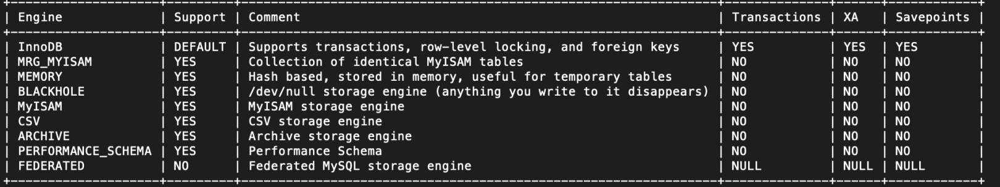

# MySQL学习笔记(2) - 基础知识

2021-06-24阅读 800

##1. 背景

本文讲[MySQL](https://cloud.tencent.com/product/cdb?from=10680)的基础知识。

###2.知识

存储引擎简介

>  存储引擎是[数据库](https://cloud.tencent.com/solution/database?from=10680)的底层组件，数据库管理系统使用引擎进行创建，查询，更新，和删除数据操作。 

命令行输入： show engines 查看：



image.png

**InnoDB存储引擎** InnoDB 是事务型数据库的首选引擎，支持事务的安全(ACID）, 支持行锁定和外键。InnoDB 是默认存储引擎。

**MyISAM存储引擎** MyISAM 用友较高的插入，查询速度，但不支持事务。

**Memory存储引擎** Memory存储引擎 将表中的数据存储到内存中，为查询和引用其他表数据提供快速访问。

**Archive存储引擎** 如果只有Insert和select操作，可以选择 Archive引擎，它支持高并发的插入操作，但是本身并不是事务安全的。Archive引擎非常适合存储归档数据，比如记录日志信息。

### 3. 示例

**(1) 登录到mysql**

```mysql
mysql -u root -p
然后输入密码
```

**(2) 创建数据库**

```mysql
CREATE DATABASE zoo;
```

**(3) 查看有哪些数据库**

```mysql
SHOW DATABASES;
```

**(4) 删除数据库**

```mysql
DROP DATABASE zoo;
```

END
